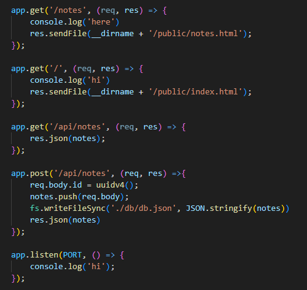

# Note Organizer

## Description
The Note Organizer is a straightforward and user-friendly note-taking web application. It ensures that your notes persist even after shutting down your computer. Easily access and review your notes by simply clicking on their titles.

[Watch Demo Video](https://watch.screencastify.com/v/I7sRo7Y37zIxneB9GH3i)

## Usage
1. Navigate to the landing page and click "Get Started" to access the notes page.
2. To create a new note, provide a title and add the details.
3. For reviewing existing notes, simply click on the respective title to view the details.

## Technologies used

Technology Used         | Resource URL           | 
| ------------- |:-------------:| 
| Git        | [https://git-scm.com/](https://git-scm.com/)     |    
| JavaScript | [https://developer.mozilla.org/en-US/docs/Web/JavaScript](https://developer.mozilla.org/en-US/docs/Web/JavaScript) |
| Express    | [http://expressjs.com/](http://expressjs.com/)  |
| Node.js    | [https://nodejs.org/en](https://nodejs.org/en)  |
| nodemon    | [https://nodemon.io/](https://nodemon.io/)  |
| uuid       | [https://www.npmjs.com/package/uuid/v/8.2.0](https://www.npmjs.com/package/uuid/v/8.2.0)  |

## Code Highlights
I have attached 2 images to highlight the routes being used and an example of how the notes data is being stored in JSON.

*Highlighted Routes*

*JSON Storage of Notes Data*

## License
This project is licensed under the [MIT License](LICENSE).

## Questions

[My GitHub Profile](https://github.com/Andrewchall92)

